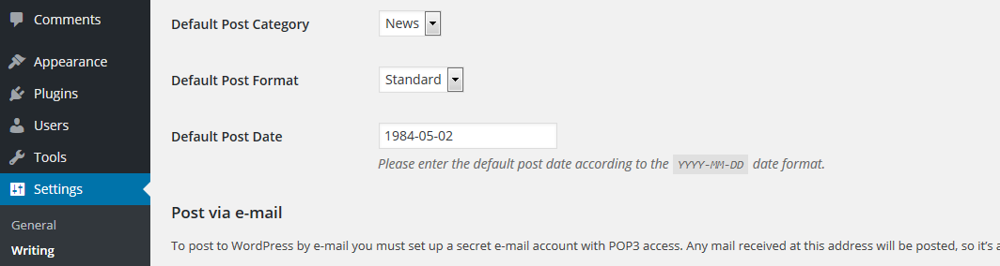

# Default Post Date

Have you ever had to create a fair amount of posts that all should be published on an individual date other than today?

Maybe some reviews of an event a while back? Or a bunch of essays scheduled for the day after tomorrow?

This is exactly when _Default Post Date_ kicks in.

## Installation

1. [Download ZIP](https://downloads.wordpress.org/plugin/default-post-date.zip).
1. Upload contents to the `/wp-content/plugins` directory on your web server.
1. Activate the plugin through the _Plugins_ menu in WordPress.
1. Find the new _Default Post Date_ setting on the _Writing Settings_ page in your WordPress backend.

## Screenshots

  
**Setting** - Here you can define the default post date.

## Contribution

If you have a feature request, or if you have developed the feature already, please feel free to use the Issues and/or Pull Requests section.

Of course, you can also provide me with translations if you would like to use the plugin in another not yet included language.

## Changelog

[Changelog](CHANGELOG.md)
